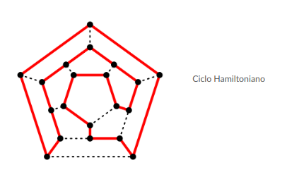

# Teoria de Algoritmos

Teoria de Algoritmos (TB024) curso 02: Echeverria

Segundo cuatrimestre 2024

- [Clase 03/09](#clase-0309)
- [Clase 05/09](#clase-0509)
- [Clase 10/09](#clase-1009)
- [Clase 12/09](#clase-1209)

## Modalidad

Clases teorico-practicas:

- Martes de 19:00 a 22:00 presencial
- Jueves de 19:00 a 22:00 virtual sincronico

Asistencia no obligatoria, con clases grabadas.

Hay 3 **TPs** (con una fecha de recuperacion) a traves del campus virtual. Tambien, hay 1 **parcial**.

Calificacion: 50% nota del parcial y 50% del promedio de los TPs.

Lenguaje a utilizar en la materia: a eleccion.

---

## Clase 03/09

### Repaso

**Complejidad**: cuanto tarda algo, y cuantos recursos requiere. Es en base al juego de datos que utiliza.

Notacion **Big O** (ordenes de magnitud): peor escenario, cota superior del costo de memoria o tiempo, en funcion al problema. Ejemplo O(N)^2 = complejidad cuadratica. Las complejidades se comparan, y ahi se define si una es mejor o peor.

#### Estructuras de Datos

- **Arreglos** y **listas**: depende de la operacion con la que vas a usar. Una lista permite detectar formas de insercion en el medio, y manejar datos de forma dinamica. Por otro lado, un array es util cuando se maneja un conjunto fijo de elementos.
- **Diccionario** (o mapas): en base a un indice (clave) permite identificar rapidamente.
- **Hash**: permite almacenar mediante una funcion de hash, garantizando una busqueda instantanea O(1) en esta materia. Sin embargo, dandole un dato de entrada gigante, el dato de salida sera de un mismo tamaño, por lo que pueden existir dos claves que den el mismo dato: *colision*.
- **Arbol** o un ABB (Arbol Binario de Busqueda): es un grafo. No puede tener ciclos, debe tener un nodo raiz y cada nodo debe tener un padre (salvo la raiz), y se disponen de los nodos hojas (sin hijos). La ventaja frente a un hash es que un ABB (donde cada nodo tiene siempre dos hijos) esta *siempre ordenado* y no tiene problemas con colisiones.

La busqueda en un hash es O(1) mientras que en un ABB es O(log N).

- **Heap** o cola de prioridad: es una cola (FIFO). La prioridad es una funcion que permite definir a quien seleccionar primero (no necesariamente al de primera posicion, sino el que tenga mejor prioridad). El agregado de un elemento de la cola de prioridad depende de la *funcion de priorizacion* para intentar acercarse lo mas posible a O(1) al momento de ordenar la cola, pero siempre la extraccion sera O(1).

#### Grafos (repaso)

Matematicamente, es un conjunto de G(V,E) donde se poseen cadas vertices y aristas. Un ejemplo de un grafo es un camino, las redes sociales, etc.

Un grafo se puede recorrer visitando los vecinos de cada nodo. Existen formas de busqueda para recorrer los grafos: **BFS** y **DFS**.

Existen algoritmos de grafos: Prim, Kruskal, Dijkstra.

### Tecnicas de diseño

#### Division y Conquista (intro)

"Tenemos un problema, se puede resolver cada subsolucion del problema dividiendolo para resolverlo completamente al final". Es una tecnica normalmente recursiva.

La complejidad de un algoritmo DyC se calcula con el **Teorema Maestro**. Para poder insertar o recorrer en un arbol se usa DyC.

Para ordenar, su costo de ordenamiento depende del algoritmo de ordenamiento utilizado. El mejor algoritmo posible de ordenamiento tiene complejidad O(N log N). El mejor algoritmo de ordenamiento (segun la materia) es **Mergesort**.

### Demostraciones Matematicas

Pequeño repaso sobre como se pueden hacer implicaciones logicas.

Tengo H => T (H implica T)

- Si H es verdadero, T es verdadero
- Si H es falso, no importa el valor de T
- Si T es falso, entonces H es falso tambien
- Pero, si T es verdadero, H puede ser verdadero o falso

Ejemplo: si esta lloviendo llevo paraguas (H => T)

- ~T => ~H: Si no llevo paraguas, no esta lloviendo
- ~H => T v ~T: Si no esta lloviendo puedo o no llevar paraguas
- T => H v ~H: Si llevo paraguas puede o no estar lloviendo

Si H implica T, ~T implica ~H

#### ¿Como se demuestra?

- Metodo directo
- Metodo indirecto o del Contrarreciproco
- Por el absurdo o la Contradiccion
- Por induccion

##### Metodo Directo

Asume que H es verdadera, y demuestra que T debe ser verdadera.


Se usa el razonamiento de que 2 * N es par.

##### Metodo Indirecto o Contrarreciproco

Asume que T es falsa y demuestra que H es necesariamente falsa tambien.


##### Por el Absurdo o la Contradiccion

Asume que H es verdadera y que T es falsa, para luego llegar a una contradiccion.


##### Por induccion

Tiene dos pasos:

- Primero, se demuestra que H(n_0) => T(n_0) es verdadero (caso base).
- Segundo, se demuestra que H(n) => T(n), y se demuestra que H(n+1) => T(n+1)


### Grafos

Grafo: *conjunto de entidades (vertices o nodos) relacionados entre si de alguna forma (aristas)*

Notacion tipica:

- G = (V,E)
- V: conjunto de vertices; V={v_1, v_2, ..., v_n}
- E: conjunto de aristas; E={(v_1, v_2), (v_3, v_4), ...}

#### Caracteristicas

- Pesados/No pesados: cada arista puede o no tener asociada un peso.
- Dirigidos/No dirigidos: de odo que puede ser o no lo mismo ir de un vertice a otro.
- Con o sin bucles: vertice unido a si mismo con una arista
- Simples/Compuestos: se pueden particionar los grafos, o se tiene un solo conjunto de nodos que no se puede particionar.

#### Formas de Recorrido

- BFS
- DFS
- Random Walk

#### Conectividad

- **Camino**: Sucesion de vertices y aristas que empieza y termina en vertices, y cuyos vertices inciden en las aristas que le suceden o preceden.
- Dos vertices U y V estan conectados si existe una arista que los une.
- **Componente (o Componente Conexa)**: Subgrafo en el que cualquier par de vertices esta conectado por un camino

**Grafos No Dirigidos**: Componentes conexas (todos conectados entre si). Tiene puntos de articulacion: vertices tales que, si son removidos, aumenta la cantidad de componentes conexas del grafo.


**Grafos Dirigidos**:

- Componentes fuertemente conexas: para todo par de vertices U y V, existe un camino (no confundir con arista) de U a V y de V a U. (camino de ida y vuelta)
- Componentes debilmente conexas: para todo par de vertices U y V, existe un camino de uno a otro vertice, independientemente del sentido. (camino de ida pero no de vuelta, o viceversa)


#### Orden Topologico

Es un ordenamiento de sus vertices tal que, para cada arista (U, V) que va de U hacia V, resulta que U viene antes que V.

Es un orden valido para recorrer grafos dirigidos; recorrido de un grafo donde cada nodo es visitado luego de que se visitaron todas sus dependencias.

Ejemplo: secuenciamiento de tareas (job scheduling), PERT, etc.

#### Grafos Bipartitos

Grafos en el que sus vertices se pueden dividir en dos subconjuntosdisjuntos e independientes U y V, tales que toda arista conecta un elemento de U con uno de V (y nada mas).

Un grafo es **completo** cuando todos los elementos estan conectados por aristas entre si. Po otro lado, un grafo es **K_mn completo** cuando todos los elementos de U tienen aristas que los unen con todos los elementos de V, con m y n vertices respectivamente.


Un grafo es bipartito *si y solo si no tiene caminos impares*

##### Distancia

Grafos no pesados: usamos BFS porque es O(N)

Grafos pesados: si todos los pesos son positivos, usamos Dijkstra. Sino, podemos usar Bellman-Ford.


#### Arbol de Tendido Minimo

**Arbol de tendido**: Dado un grafo no dirigido G, es un subgrafo que ademas es un arbol. Incluye todos los vertices del grafo.

**Arbol de tendido minimo**: Dado un grafo pesado G, es un arbol de tendido de G tal que su peso es el minimo. *Algoritmo de Prim y Kruskal*. Solo tiene sentido hablar de un Arbol de Tendido minimo cuando se trata de un grafo pesado.

#### Representacion de un Grafo

- **Matriz de Adyacencia**: mide cuantas aristas hay entre cada par de vertices.
  - Es cuadrada: V x V
  - Si el grafo no es dirigido, es simetrica
  - Si no hay bucles, la diagonal principal son todos ceros.
- **Lista de Adyacencia**: lista de todas las aristas. (conjunto E que define a un grafo)
- **Matriz de Incidencia** (se usa muy poco): mide si existe o no una arista entre cada par de vertices.

##### Potenciacion de la Matriz de Adyacencia

Sea A la matriz de adyacencia de un grafo (dirigido o no). Entonces el elemento a_ij denota si dos vertices (i,j) son adyacentes o no.

**Teorema**: A ^ n (el producto de matrices de A consigo misma n veces) resulta en una matriz cuyo elemento A_ij ^ n denota la cantidad de caminos de distancia n entre (i,j)


---

## Clase 05/09

### Arboles

Un arbol es un grafo G tal que, para todo par de vertices (u,v) existe un unico camino (secuencia de aristas entre dos vertices, *una arista es un camino de distancia 1*) de u hacia v.

Propiedades:

- Todo arbol es conexo (existen caminos desde cualquier vertice a cualquier otro)
- Todo arbol es aciclico (no tienen ciclos)
- Todo arbol tiene una cantidad de aristas igual a la cantidad de vertices menos 1 (garantiza que sea aciclico)

Si un grafo cumple con dos de estas tres propiedades, es un arbol y si o si va a cumplir la tercera.

### Handshaking Lemma

Propiedad enunciada en forma de lema (lema del apreton de manos).

Lema: *En todo grafo no dirigido, la cantidad de vertices de grado impar es par.*

Cuando dos personas se dan la mano, la cantidad de vertices (personas) de grado impar (dandose la mano con jna persona) es par.

### Clique

Clique: *Un clique de un grafo G es subgrafo de G que es completo.*

Es un conjunto de vertices de un grafo G tal que todo par de dichos vertices es adyacente.


Un n-clique es un clique de n vertices

### Grafo Regular

Un grafo d-regular es un grafo donde todos sus vertices tienen grado d (no implica que sea un grafo conexo)

Propiedades:

- El vector unitario es autovector de la matriz de adyacencia, y su autovalor es d
- Un grafo completo es un grafo regular (n-1 regular)
- Teorema de Nash-Williams: todo grafo k-regular con 2k+1 vertices tiene un ciclo Hamiltoniano
- Los grafos 2-regular se llaman cubicos

### Ciclo Hamiltoniano y Euleriano

**Camino de Euler**: un camino que pasa por todas las aristas una sola vez

**Ciclo de Euler**: un camino que empieza y termina en un vertice y visita todas las aristas

La diferencia entre camino y ciclo es que *el ciclo se cierra en el vertice de origen, el camino queda abierto*.

- Un grafo no dirigido tiene un ciclo de Euler si y solo si todos sus nodos tienen grado par
- Un grafo no dirigido tiene un camino de Euler si y solo si tiene exactamente dos vertices de grado impar

**Camino/Ciclo Hamiltoniano**: Es identico al de Euler, pero pasando por todos los vertices *una sola vez* (excepto el vertice de partida, que es el mismo de llegada).



### Isomorfismos

Es una herramienta que se usara mas adelante para jugar con grafos y manipularlos para llegar a algo que nos conviene.

Un ifomorfismo de los grafos G y H es una biyeccion (una biyeccion es una funcion que vincula elementos entre dos conjuntos, en este caso es una biyeccion entre dos grafos, que vincula cada vertice de los grafos con uno de los vertices del otro grafo, de modo que todos los vertices quedan relacionados: RELACION 1 A 1 entre vertices de los grafos), sobre los vertices de G y H, `f:V(G) -> V(H)` tal que cualquier par de vertices (u,v) son adyacentes en G si y solo si f(u) y f(v) en H tambien son adyacentes.


Cuando hablamos de un isomorfismo, se trata de una biyeccion de la cual, cualquier par de vertices adyacentes de un grafo son tambien adyacentes en el otro. Esto vale para cada par de vertices de cada grafo.

Esto es util para transformar un grafo incomodo (retorcido) en uno mas util.

---

### Division y Conquista

Principio de division y conquista: voy partiendo el problema en partes mas chicas hasta que quede algo muy pequeño y facil de resolver.

Ejemplo de pseudocodigo: (funcion recursiva)

```python
def p(X de tamaño n):
  si n < una constante k:
    resolver x y devolver el resultado
  si no:
    crear subproblemas de X, de tamaño n/b
    llamar recursivamente a p() sobre cada subproblema
    Combinar los resultados de los problemas
```

Complejidad temporal del algoritmo recursivo, mediante su ecuacion de recurrencia, es:
`T(n) = A T(n/b) + O(n^c)`
Donde:

- A: Cantidad de llamadas recursivas
- b: Proporcion de los subproblemas
- C: Costo de combinar los sub-resultados

Por lo que significa que la ecuacion de recurrencia va a ser: A x el tiempo que tarda en procesar los subproblemas + el tiempo que tarda en juntar los resultados.

#### Teorema Maestro

El **Teorema Maestro** nos da, mediante una ecuacion de recurrencia, define la complejidad temporal de un algoritmo.

El teorema maestro indica como cota superior:

- Si `log_b A < C` => `T(n) = O(n^c)`
- Si `log_b A = C` => `T(n) = O(n^c log_b n)`
- Si `log_b A > C` => `T(n) = O(n^c log_b A)`

### Algoritmo de Karatsuba

Algoritmo capaz de multiplicar dos números de n dígitos en O(n log_2 3), o bien, O(n 1,58). Mucho mejor que O(n^2).

```python
def multiplicacionBigInt(X, Y):
  si largo de X e Y son pequeños:
    return X*Y
  si no:
    X = x1 2^n/2 + x0
    Y = y1 2^n/2 + y0

    p = multiplicacionBigInt(x1 + x0, y1 + y0)
    x0y0 = multiplicacionBigInt(x0, y0)
    x1y1 = multiplicacionBigInt(x1, y1)

    return x1y1 2^n + (p - x1y1 - x0y0) 2^n/2 + x0y0
```

El concepto que nos tiene que quedar es que tenemos que estar atentos por si en algun momento de nuestro algoritmo podemos reutilizar parte de los resultados que ya tenemos, lo cual nos permitiria extraerle un poco mas de eficiencia al algoritmo.

### Conteo de Inversiones

Supongamos que tenemos un conjunto de n elementos. Alguien los ordena de una forma y otra persona los ordena de otra forma. *¿Se puede definir una metrica que diga que tan "diferentes" son los dos ordenamientos?*

**Inversiones**: Dos indices i < j forman una inversion cuando a_i > a_j. Si contamos la cantidad de inversiones entre dos listas, sabremos que tan desordenadas estan entre si.


Si la segunda lista hubiese estado ordenada exactamente al reves, habrian 28 inversiones en total. Si ambas listas tuviesen el mismo ordenamiento, habrian 0 inversiones.

Una forma basica para contar inversiones es iterando para cada i y para cada j, aunque es muy malo: O(n ^ 2).

Por esto, se puede adaptar **Mergesort** para contar inversiones:


El funcionamiento es identico al Mergesort, solo que se van guardando la cantidad de inversiones que se realizan al momento de unir los segmentos separados.

- Relacion de Recursividad: `T(n) = 2 T (n/2) + O(n)` (identica a la ecuacion de Mergesort)
- Por el Teorema Maestro: `T(n) = O(n log n)` (mejor que n^2)

### Punto extremo en un poligono convexo

Propiedades de poligonos convexos:

- La suma de sus angulos interiores es menor o igual a 180°
- Es monotonico para todo segmento L (a lo sumo cruzara dos veces el poligono)
- Todo par de puntos del poligono pueden ser unidos por un segmento totalmente incluido en el.


Un **punto extremo** es un punto *x* donde la funcion f(x) toma el valor maximo o minimo. (maximo absoluto o minimo absoluto)


Dado un conjunto de vertices V = {v_1, v_2, ..., v_n}, encontrar cual de ellos es el punto extremo de f(v).

Posible solucion: para cada v_i en V, se evalua f(v_i) y se queda con la que hace maxima (o minima) a f(v_i). Sin emnargo, esto tiene de complejidad `O (n)`

**Solucion**: Vamos a recorrer los vertices en sentido antihorario. Definimos `e v_i = f(v_i+1) - f(v_i)` la cual es una medida del crecimiento de f(v) (si nos acercamos/alejamos al punto extremo).


Pasos a seguir:

- Dividimos el poliedro en dos, definiendo una secuencia de puntos entre v_a y v_b.
- Tomamos un punto intermedio v_c de esa secuencia.
- Analizamos ev_a y ev_c, y determinamos (criteriosamente) con qué tramo de la secuencia nos quedamos.
- Cuando la secuencia tiene sólo tres elementos, comparamos f(v_a), f(v_b) y f(v_c), y nos quedamos con el máximo/mínimo.

Cabe destacar que, al programarlo, va a ser una lista (una secuencia...).

Escenarios posibles:


Soluciones (ejemplo):


Resumen:

- Iniciamos con todos los puntos del polígono y determinamos v_c (punto intermedio)
- Si sólo quedan 3 vértices, compararlos y obtener el punto extremo
- Si no, determinar qué escenario aplica
- Actualizar v_a, v_b, v_c según el escenario y hacer la recursión

En cada iteracion ¿Cuantos llamados recursivos hago? Solo 1! (parece una busqueda binaria, donde se hace dos llamados resursivos, pero solo se hace una llamada recursiva en este algoritmo por iteracion, ya que al dividir se descarta la otra seccion)

**Complejidad temporal**: `T(n) = T(n/2) + O(1)`
**Por el Teorema Maestro**: `T(n) = O(log n)`

### Otros problemas de DyC

- Puntos más cercanos en el plano (mas cercanos entre si o determinada linea, se puede usar algo que ya vimos para analizarlo)
- Convoluciones (transformacion matematica entre dos funciones que es la suma de las multiplicaciones de todos los valores de una funcion con todos los valores de otra funcion, que se puede resolver con DyC) y FFT (Transformada Rápida de Fourier, que se puede acelerar la revolucion con DyC)
- Mediana de dos conjuntos

---

## Clase 10/09

### Algoritmos Greedy

Son algoritmos que tratan de encontrar una solucion optima global a un problema dado. La idea es que se aplique una regla sencilla en cada paso, tomando decisiones localmente optimas para el estado actual.

Itera y vuelve a aplicar la regla para tomar la decision localmente optima del nuevo estado actual. Y, puede considerar resultados previos pero *no futuros*.

#### Algoritmo de Dijkstra

Recorre un grafo para encontrar el camino minimo desde un vertice hasta otro.

Se usa para grafos ponderados (con peso), y no debe tener pesos o ciclos con pesos negativos.

¿Cómo funciona el algoritmo de Dijkstra?

- Parte de un vértice
- Busca el siguiente vértice que haga mínimo el camino completo
- Se apoya en un heap para mejorar la búsqueda del siguiente vértice

Este algoritmo funciona usando un heap de minimos guardando las aristas, para que nos devuelva la arista mas pequeña conectada con el vertice de esa iteracion.

**Regla Greedy**: Toma el proximo vertice con la arista minima.

Dijkstra es un *algoritmo Greedy*. La “regla sencilla” es que toma el próximo vértice que tenga la arista más liviana. Repite la regla en cada paso. El heap que utiliza no interviene en la parte Greedy, sirve como complemento para optimizar la búsqueda del próximo vértice.

#### Algoritmo de Prim

Busca el arbol de tendido minimo, donde el peso total de las aristas es el minimo posible para grafos ponderados.

El funcionamiento del algoritmo es el siguiente: parte de un vertice arbitrario, busca la siguiente arista de menor peso posible, y controla que no se formen ciclos.

Prim también es un *algoritmo Greedy*. La “regla sencilla” es que toma la arista de menor peso que aún no se insertó. Repite la regla en cada paso. El control de que no se formen ciclos es una restricción del árbol que se desea armar, no de la regla greedy.

#### Algoritmo de Kruskal

Tambien busca el arbol de tendido minimo. Al igual que prim, ordena las aristas por peso e incorpora la salida de menor peso. Este algoritmo tambien es para grafos ponderados.

Funcionamiento:

- Ordena las aristas por peso
- Incorpora la arista de peso mínimo
- Controla que no se formen ciclos con una estructura *union-find*

Kruskal también es un *algoritmo Greedy*. La “regla sencilla” es que toma la arista de peso mínimo que aún no se insertó. Repite la regla en cada paso. El control de que no se formen ciclos se hace con la estructura union-find; también es una restricción del resultado buscado, no de las reglas de Greedy.

**Algoritmos Greedy**: buscan un optimo local para llegar a un optimo global.

Desventajas:

- Suele ser difícil demostrar que un algoritmo greedy halle siempre el óptimo global
- Pueden fallar catastróficamente

Ventajas:

- Son intuitivos, fáciles de entender
- Son de implementación sencilla
- Son rápidos ("muy economicos")
- Aunque no encuentren el óptimo global, se pueden aprovechar:
  - Como aproximación a la solución óptima
  - Como entrada a otro algoritmo más complejo

#### Solucion desastrosa con Greedy


Un **algoritmo greedy** es muy facil de entender, programar y ejecutar, pero la solucion puede ser muy mala, y a veces es muy complicado definir si es la solucion optima (por mas de que es una solucion factible)

#### Interval Scheduling

Tenemos un conjunto de tareas S={1,2,..., n}. La i-ésima tarea empieza en el horario s(i) y termina en el horario f(i) (y no se pueden modificar ni interrumpir).

Definición: un subconjunto de tareas es compatible si no hay solapamiento entre ellas


Solo nos interesa la *cantidad* en este problema. El algoritmo greedy que se propone es:

- Seleccionar una tarea i1 siguiendo una regla sencilla
- Rechazar todas las tareas que no sean compatibles
- Seleccionar la segunda tarea i2 para su consideración
- Rechazar todas las tareas que no sean compatibles con i2
- Repetir hasta que no queden tareas

Se puede tener en consideracion una tarea de menor tamaño, o la primer tarea que comienza lo antes posible...

- Opción 1: Tomar la próxima tarea que empiece lo antes posible. (no es buena idea)
- Opción 2: Tomar la próxima tarea más corta posible. (no es buena idea)
- Opción 3: Tomar la próxima tarea que termine antes.


```python
def scheduling(tareas)
  tareas_ordenadas=ordenar_tareas_por_fin(tareas) # O(n log n)
  calendario=[]
  for tarea in tareas_ordenadas: # O(n)
    if len(calendario)==0 or not incompatibles(calendario[-1], tarea) # O(1)
      calendario.append(tarea)
  return calendario

def incompatibles(anterior, posterior) # O(1)
  return posterior[INICIO] < anterior[FIN]
```

Complejidad del algoritmo:
`O(n log n) + O(n) * O(1) = O(n log n)`

### Codigos de Huffman

Usados para compresión de datos sin pérdidas, permiten encontrar una codificación basada en la frecuencia de aparición de los símbolos, y reducir la longitud promedio de los códigos.

El objetivo es que los símbolos más frecuentes puedan ser codificados con menos bits que los menos frecuentes. El algoritmo de generación usa un heap (de mínimo) para mantener los símbolos según sus frecuencias.

#### Codificacion

- Determinar la frecuencia de los símbolos del mensaje
- Cargar los símbolos y sus frecuencias en un heap
- Mientras el heap no esté vacío:
  - Tomar los próximos dos elementos del heap, “x”, “y”
  - Construir un nuevo símbolo “xy” con frecuencia igual a la suma de las frecuencias de “x” y de “y”
  - Agregar al heap el nuevo símbolo “xy” con su frecuencia
  - Agregar al árbol T una nueva hoja “xy” con su frecuencia.
  - Agregar debajo de la nueva hoja “xy” los nodos para “x” e “y” con sus frecuencias
- Construir el código de Huffman asignando 0 y 1 a las aristas del árbol (una vez termine el loop)

**Regla greedy**: tomar los proximos dos elementos del heap. Esta regla, junto a la iteracion, son fundamentales en un *Algoritmo Greedy*

#### Ejemplo de Codigo de Huffman

Palabra: ABRACADABRA. Tabla de frecuencias:

| C | D | B | R | A |
| - | - | - | - | - |
| 1 | 1 | 2 | 2 | 5 |

Primer iteracion:


| B | R | CD | A |
| - | - | -- | - |
| 2 | 2 | 2  | 5 |

Segunda iteracion:


| CD | BR | A |
| -- | -- | - |
| 2  | 4  | 5 |

Tercer iteracion:


| A | CDBR |
| - | ---- |
| 5 | 6    |

Ultima iteracion:


| CDBRA |
| ----- |
| 11    |

Ya luego de esta ultima iteracion, el heap no tiene mas elementos.

**Decodificacion**: El emisor envía el mensaje codificado junto con la tabla de frecuencias (estas son las dos unicas cosas que el receptor debe saber), y el receptor construye el código de Huffman y decodifica el mensaje.


*ABRACADABRA*: 1-010-011-1-000-1-001-1-010-011-1 (19 bits)

No hace falta señalar con guiones debido a que es un codigo prefijo.

Este es un *algoritmo greedy* debido a que agarro un par de elementos del heap por frecuencia cresciente.

- Regla sencilla: tomar el próximo par de símbolos, que están priorizados de menor a mayor frecuencia de aparición.
- Un símbolo con baja frecuencia terminará siendo representado con más bits, y viceversa.

En resumen, reformulando la regla sencilla, *Agregar un bit más a los dos símbolos que menor frecuencia acumulan*.

```python
def huffman(mensaje)
  frecuencias=calcular_frecuencias(mensaje) # O(n)
  q=heap_crear() # O(1)
  for simbolo in frecuencias #  O(m log m)
    q.encolar(Hoja(simbolo, frecuencias))
  while q.cantidad > 1 # O(m log m)
    t1=q.desencolar()
    t2=q.desencolar()
    q.encolar(Arbol(t1, t2, t.frecuencia + t2.frecuencia))
  return codificar(mensaje, q.desencolar()) # O(n)
```

Complejidad temporal:
`O(n) + 2 O(m log m) + O(n) = O(n log m)`
Considerando que m (cantidad de simbolos distintos) <= n (longitud del mensaje)

### Problema del cambio de monedas

Dado un sistema monetario S formado por n monedas S={m1, m2, …, mn}, encontrar la mínima cantidad de monedas necesarias para sumar cierto monto de dinero.

**Regla greedy**: usemos la moneda de mayor denominacion posible todas las veces que se pueda.

Descripcion del algoritmo:

- Ordenar las monedas por denominación, de mayor a menor
- Tomar la próxima denominación
- Determinar cuántas veces entra la denominación en el monto a dar
- Tomar el resto de la división entera
- Repetir 2 hasta que el resto de la división entera sea cero

Ejemplo: S = {1, 2, 5, 10, 50, 100} (S = Sistema monetario)

- Monto: 22. Solución: 2 monedas de 10, una moneda de 2
- Monto: 40. Solución: 4 monedas de 10
- Monto: 23. Solución: 2 monedas de 10, una de 2, una de 1
- Monto: 40. Solución: 1 moneda de 25, una de 10, una de 5. O mejor, dos monedas de 20.

Este algoritmo esta fuertemente atado al sistema monetario, por lo que de esto depende la optimalidad del algoritmo.

### Otro problema: *compras con inflacion*

- Se tiene un conjunto de n productos a comprar, cada uno con un precio p_i>1
- Sólo se puede comprar un producto por día.
- Por cada día que pasa, los productos aumentan de precio en una tasa t>1, de manera que luego de d días, el valor de p_i es p_i t^d

¿En qué orden habría que comprar los productos para que el costo total sea mínimo? Primero se compra el mas caro.

Posible algoritmo:

- Ordenar los productos por precio, de mayor a menor
- Tomar el próximo producto
- Acumular el costo
- Remover el producto
- Repetir desde 2 hasta que no queden más productos

Se puede demostrar que este algoritmo es óptimo.

Si hubiera habido *deflacion*, habria que comprar primero el mas barato, ya que la disminucion de precio va a ser menor a comparacion del producto mas caro.

### Otro problema: *carga de combustible*

- Un camión debe recorrer una distancia r para ir desde un punto a otro
- Puede recorrer una distancia máxima k con su tanque lleno (autonomía)
- Las sucesivas estaciones de servicio (ei-1; ei) a lo largo de la ruta están separadas por una distancia di.

Determinar: *en qué estaciones debe detenerse a cargar combustible para que la cantidad total de paradas sea la mínima posible*.

**Regla greedy**: aplazar la carga lo mas posible.

Posible algoritmo:

- Inicializar el odómetro parcial Op=0
- Tomar la distancia d a la siguiente estación
- Si d > k - Op
  - Cargar combustible
  - Reiniciar el odómetro parcial Op=0
- Si no
  - Op = Op + d
- Repetir hasta llegar a destino

---

## Clase 12/09
